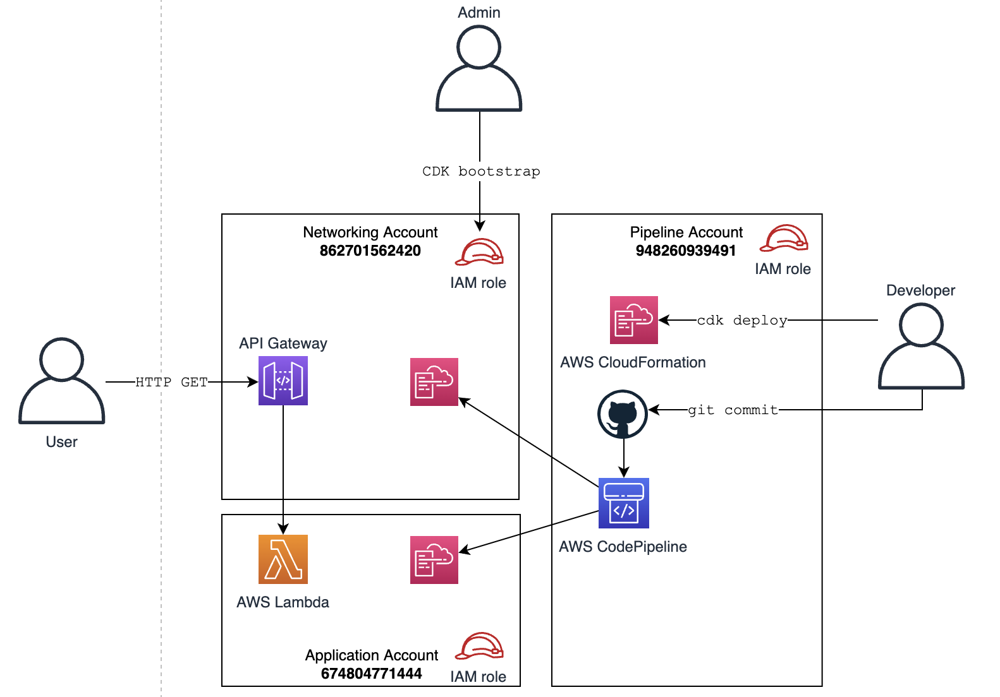

# Cross-account API Gateway/Lambda CDK Pipeline

# Introduction


# Instructions
This projects pipeline is based on these instructions in the CDK documentation: https://docs.aws.amazon.com/cdk/v2/guide/cdk_pipeline.html

## Step 1 - Bootstrap pipeline account
```
export CDK_NEW_BOOTSTRAP=1

cdk bootstrap aws://ACCOUNT-NUMBER/REGION --profile ADMIN-PROFILE --cloudformation-execution-policies arn:aws:iam::aws:policy/AdministratorAccess aws://ACCOUNT-ID/REGION
```
e.g. for my accounts this is
```
cdk bootstrap --profile pipeline aws://948260939491/eu-west-1 --cloudformation-execution-policies arn:aws:iam::aws:policy/AdministratorAccess aws://948260939491/eu-west-1
```
## Step 2 - Bootstrap additional accounts

To bootstrap additional environments into which AWS CDK applications will be deployed by the pipeline, use the commands below instead. The *—trust* option indicates which other account should have permissions to deploy AWS CDK applications into this environment; specify the pipeline's AWS account ID.
```
cdk bootstrap aws://ACCOUNT-NUMBER/REGION —profile ADMIN-PROFILE \
--cloudformation-execution-policies arn:aws:iam::aws:policy/AdministratorAccess \
--trust PIPELINE-ACCOUNT-ID aws://ACCOUNT-ID/REGION
```
e.g. for my accounts this is
```
cdk bootstrap aws://862701562420/eu-west-1 --profile networking --cloudformation-execution-policies arn:aws:iam::aws:policy/AdministratorAccess --trust 948260939491 aws://862701562420/eu-west-1

cdk bootstrap aws://674804771444/eu-west-1 --profile application --cloudformation-execution-policies arn:aws:iam::aws:policy/AdministratorAccess --trust 948260939491 aws://674804771444/eu-west-1
```

## First setup of CDK
To manually create a virtualenv on MacOS and Linux:

```
$ python3 -m venv .venv
```

After the init process completes and the virtualenv is created, you can use the following
step to activate your virtualenv.

```
$ source .venv/bin/activate
```

Once the virtualenv is activated, you can install the required dependencies.

```
$ pip install -r requirements.txt
```

## Configure GitHub repository
> Configure `my_pipeline/my_pipeline_stack.py` with your own GitHub name/repo

> By default, the pipeline authenticates to GitHub using a personal access token stored in Secrets Manager under the name `github-token`


## First-time CDK deploy
At this point you can now synthesize the CloudFormation template for this code.

```
$ cdk synth
$ cdk deploy
```

## Trigger the Pipeline
Now we don't have to run cdk deploy for subsequent updates, we just make changes and run `git commit` to this repo will now trigger the pipeline

```
git add --all
git commit -m "initial commit"
git push
cdk deploy
```

# Implementation notes

Note in `my_pipeline/my_pipeline_app_stage.py` we define `CustomLambdaIntegration` which overrides the `bind()` function. This is because in the LambdaIntegration Construct here https://github.com/aws/aws-cdk/blob/master/packages/%40aws-cdk/aws-apigateway/lib/integrations/lambda.ts the permissions are created with the construct - this only works in the single account case and so we avoid this and instead, manually call `backend_function.add_permission()` in `my_pipeline/my_pipeline_lambda_stack.py`